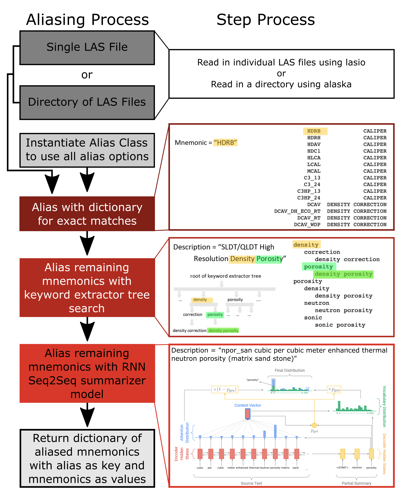

# Summary

Well logging is the act of measuring of the physical properties of rocks in and around a subsurface well. Wireline well logs are the recorded measurements of these physical properties with reference to some zero point at the surface [@Ellis:2007]. Well logs are used by subsurface scientists and engineers to identify and label formations, design completions, and predict subsurface fluid types and rock properties [@Ellis:2007]. Despite their importance in subsurface workflows, digital well log files contain a variety of different types of curves. These curves are labeled with mnemonics that often vary depending on several factor such as the company that logged the well, the age of the well, and the type of tool used to log the well.

When conducting subsurface studies, workers must first sift through these mnemonics and alias them to one common label or mnemonic. For example the mnemonics of GRGC, GRGM, and GR are all different variations of mnemonics used for the gamma-ray log. In other cases, domain experts must read through the well-log description, mnemonic, and units to make a decision on if and how the curve should be aliased. This is not a new problem for subsurface studies. Basic well-log management has been around since the early 1990's and focused heavily on lookup tables for closed source software [@Tan:1995].

``alaska`` is an open-source Python package that provides several functionalities: (1) it uses a dictionary search to alias mnemonics from digital well log files, (2) it also uses a keyword extractor search when the dictionary lookup does not find the exact mnemonic alias, (3) it has a deep-learning based natural language processing summarizer modified from [@Fang:2018] to alias unknown well-log mnemonics, and (4) it contains a method to visually inspect well log aliases.

## Aliasing

The workflow for ``alaska`` is summarized in Figure 1 (modified from [@See:2017]) and a quick start example is provided in the `parse.py` tutorial. For the users looking to alias their digital well log files, the `Alias` class and `parse` method are used to alias both known and unknown mnemonics to human readable aliases. To use the dictionary search, keyword extractor, and deep-learning model the parameters must be set at instantiation of the `Alias` class. 

## Alias Class

The `Alias` class in ``alaska`` is a class used for parsing, organizing, and quality control of aliasing results. An `Alias` class can parse single well logs or all the logs in a specific directory using any combination of the dictionary search, keyword extractor search, and model search. The parsed output from the instantiated class can then be output to a ``pandas`` dataframe for use in other well log packages such as ``welly`` [@Hall:2020] or for import into commercial software. Lastly the ``Alias`` class contains a method to control the quality of the deep-learning model predictions. The `heatmap` method returns a heatmap plot for the probability of each mnemonic belonging to each alias. This is useful for domain experts to make decisions about the quality of the model aliasing and choosing a probability cutoff that is appropriate for their use case. 

## Pointer Generator Aliasing

We provide a pre-trained pointer generator recurrent neural network (RNN) summarizer [@See:2017] that was trained on Maverick2 at the Texas Advanced Computing Center to summarize well-log mnemonics, descriptions, and units to a human readable alias. However, many users might want to provide their own custom vocabulary that includes new mnemonics, descriptions, and units for training the RNN. 

To train a new model we have included a tutorial `easy_train.py` which covers simple training of the pointer generator RNN. Users must build training and validation datasets  with `.gz` extensions. The model state will be saved locally for the user to load into the `Alias` class at instantiation. For users that wish to change parameters inside the RNN model, we also provide `model.py` and `params.py` in the training tutorial which can be modified without changing the original model architecture inside the package.

After training a custom model with a user-defined vocabulary, the user can then parse their well logs in the same manner as before by changing the path to the model to their new custom model. The dictionary search and keyword extractor search will remain unchanged if the user builds a new RNN model. 

# Acknowledgements

We would like to acknowledge financial support from ConocoPhillips for this project through the Freshman Research Initiative at the University of Texas at Austin. We would also like to acknowledge the Texas Advanced Computing Center for compute time on Maverick2 for training the Pointer-Generator model.

# References